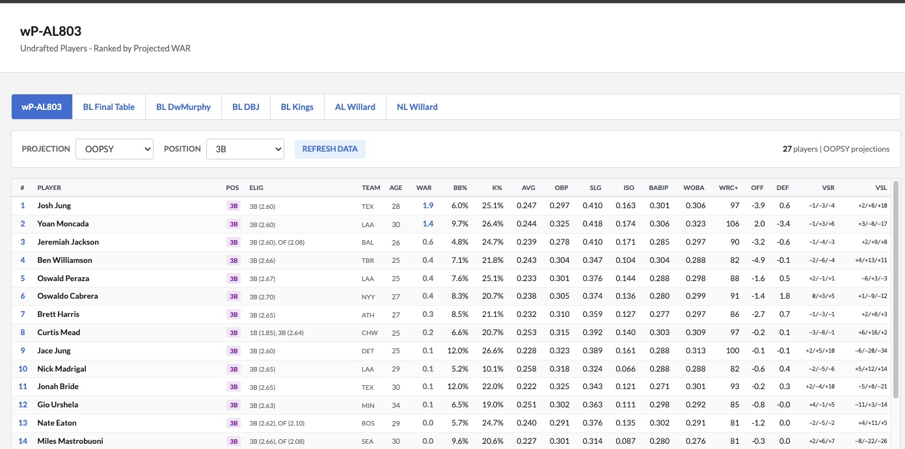
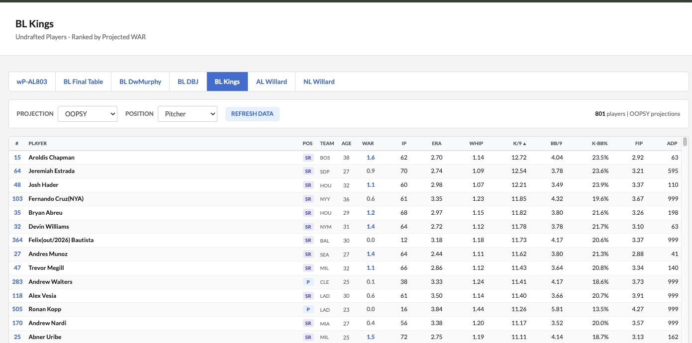

# Scoresheet League Ranker

A Spring Boot web application that ranks undrafted players from Scoresheet fantasy baseball leagues using projection data from multiple systems (STEAMER, OOPSY, ZiPS).

## Screenshots

### Batters View


### Pitchers View


## Features

- Fetches undrafted players from multiple Scoresheet leagues
- Automatically excludes drafted players
- Ranks players by projected WAR
- Supports three projection systems: STEAMER, OOPSY, ZiPS
- Separate views for batters and pitchers
- Displays advanced stats in a FanGraphs-style interface
- Shows positional eligibility with defensive ranges
- Displays platoon split adjustments (vs RHP/LHP)
- Sortable columns (click headers to sort)
- Filter by position (BATTER, Pitcher, P, SR, C, 1B, 2B, 3B, SS, OF, DH)

## Requirements

- Java 21
- Scoresheet account credentials

## Configuration

### 1. Create login.properties

Copy `login.properties.example` to `login.properties` and fill in your Scoresheet credentials:

```bash
cp login.properties.example login.properties
```

Then edit `login.properties` with your actual credentials:

```properties
scoresheet.login.firstname=John
scoresheet.login.lastname=Smith
scoresheet.login.password=mypassword123
```

The application will not start without valid credentials configured.

### 2. Projection Data Files

Place the following CSV files in the project root:

- `steamer-batting-projections.csv`
- `steamer-pitching-projections.csv`
- `oopsy-batting-projections.csv`
- `oopsy-pitching-projections.csv`
- `zips-batting-projections.csv`
- `zips-pitching-projections.csv`

### 3. Player Mapping File

Place `BL_Players_2026.tsv` in the project root. This file maps Scoresheet player IDs to MLBAM IDs and contains positional ranges and split adjustments.

## Building

```bash
./mvnw clean compile
```

## Running

```bash
./mvnw spring-boot:run
```

On Windows, use `mvnw.cmd` instead of `./mvnw`.

The application will start on port 8888. Open http://localhost:8888 in your browser.

## Usage

1. Select a league from the navigation tabs
2. Choose a projection system from the dropdown
3. Filter by position using the position dropdown
4. Click column headers to sort
5. Click "Refresh Data" to re-fetch undrafted players from Scoresheet

## Supported Leagues

The following leagues are configured by default:

- wP-AL803
- BL Final Table
- BL DwMurphy
- BL DBJ
- BL Kings
- AL Willard
- NL Willard

To add additional leagues, edit `application.properties`.

## Stats Displayed

### Batters
- WAR, Age, BB%, K%, AVG, OBP, SLG, ISO, BABIP, wOBA, wRC+, Off, Def
- Positional eligibility with defensive ranges
- Platoon splits vs RHP and LHP

### Pitchers
- WAR, Age, IP, ERA, WHIP, K/9, BB/9, K-BB%, FIP, ADP

## Project Structure

```
src/main/java/com/scoutingthestatline/ranker/
├── LeagueRankerApplication.java
├── config/
│   ├── LeagueProperties.java
│   └── LoginValidator.java
├── controller/
│   └── LeagueController.java
├── model/
│   ├── League.java
│   ├── Player.java
│   ├── RankedPlayer.java
│   ├── BattingProjection.java
│   └── PitchingProjection.java
└── service/
    ├── ScoresheetService.java
    ├── PlayerMappingService.java
    ├── ProjectionService.java
    └── RankingService.java
```

## License

Apache License 2.0
